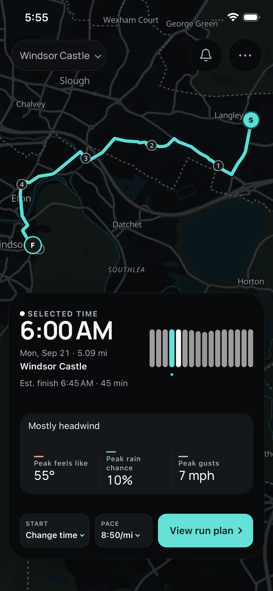
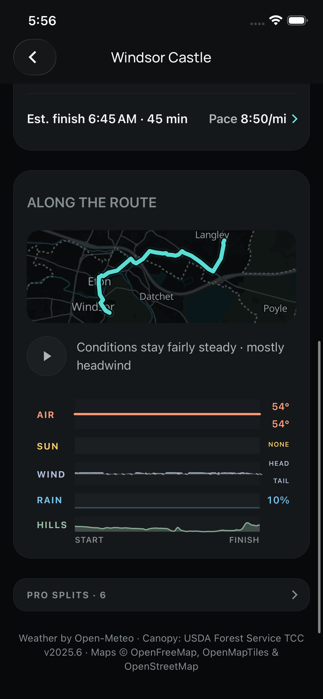
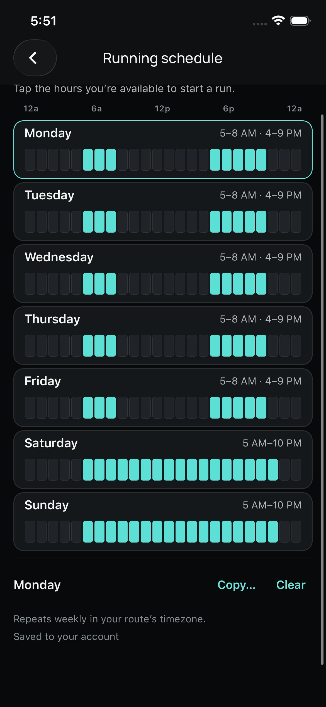
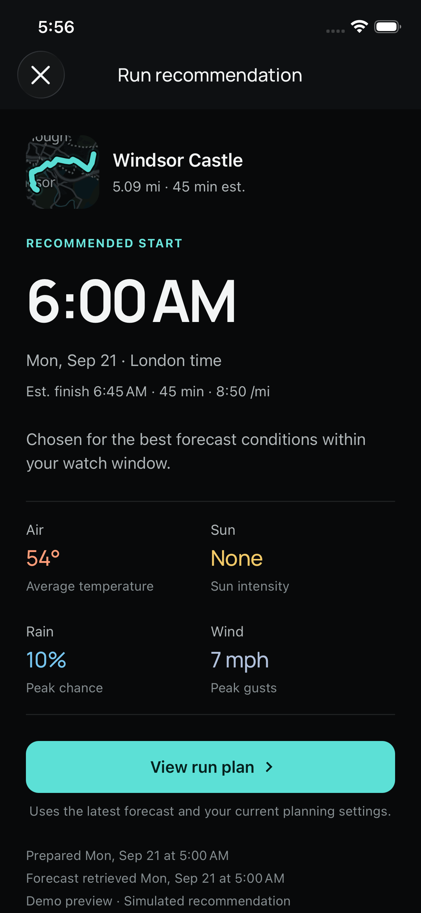

# Runcast

Find the best time to run, based on the weather along your route.

I built Runcast to estimate the conditions I would encounter throughout a run and compare different departure times. It combines route geometry, elevation, pace, and weather forecasts to recommend a start time within the runner's availability. The iOS app is in beta.

<p align="center">
  
  
</p>
<p align="center"><sub>Route overview and the forecast from start to finish.</sub></p>

## Modeling the run

The pure TypeScript engine estimates arrival times along the route using grade-adjusted pace, then interpolates Open-Meteo forecasts across location and time. Wind is resolved relative to travel direction. Sun exposure combines solar position, forecast radiation, and available canopy evidence; missing canopy data receives open-sky exposure.

`recommendStartV3` evaluates departures on a 15-minute grid, checks forecast coverage and hazards, and ranks suitable candidates. Mobile, web, and scheduled evaluations use the same engine. Cached forecast data lets the app compare another departure locally.

## From availability to a recommendation

Guest planning supports bundled routes and local GPX files. Signing in with Strava also lets runners import saved routes. Route watches use a shared weekly schedule or a custom run window. The scheduler reevaluates forecasts and saves versioned results, so an alert opens the recommendation that produced it. Newer advice remains available separately, with a configurable, limited follow-up policy for meaningful changes.

<p align="center">
  
  
</p>
<p align="center"><sub>Weekly availability constrains the start times considered by the planner.</sub></p>

## System design

| Package                                    | Responsibility                                                                                             |
| ------------------------------------------ | ---------------------------------------------------------------------------------------------------------- |
| [`packages/core`](packages/core)           | Route timing, weather sampling, exposure modeling, and recommendations                                     |
| [`packages/contracts`](packages/contracts) | Zod schemas for versioned APIs and planning artifacts                                                      |
| [`apps/mobile`](apps/mobile)               | React Native / Expo app, local planning, durable SQLite edits, and notification navigation                 |
| [`apps/api`](apps/api)                     | Fastify, Drizzle / PostgreSQL, authentication, forecast caching, scheduled watches, and Expo push delivery |
| [`apps/web`](apps/web)                     | React / Vite guest planner using the shared engine                                                         |

The API uses a transactional notification outbox and idempotent mutations. Mobile queues edits in durable SQLite; optimistic versions expose conflicts during synchronization. Account data is owner-scoped, provider credentials are encrypted, and refresh tokens rotate on use. Guest GPX files are never uploaded automatically.

## Run locally

Use Node **22.13+**. Start with the guest web planner:

```sh
npm ci
npm run dev          # http://localhost:5173
```

For the API and mobile app, start PostgreSQL, apply migrations, then run each server in its own terminal. iOS requires an Expo development build.

```sh
npm run db:up
npm run db:migrate
npm run dev:api      # http://localhost:3000; OpenAPI at /docs
npm run start -w apps/mobile
```

See the [API environment example](apps/api/.env.example) and [mobile environment example](apps/mobile/.env.example) for configuration. Strava, Apple sign-in, and remote push require their provider setup; guest planning does not.

## Verification and documentation

```sh
npm run typecheck
npm test
npm run architecture:check
RUN_DB_TESTS=true npm run test:integration -w apps/api
```

[Architecture](docs/architecture.md) · [Modeling details](docs/algorithm-improvements/README.md) · [Operations and deployment](docs/operations.md) · [Beta release checklist](docs/release-checklist.md) · [Privacy](docs/legal/privacy.md) · [MIT license](LICENSE)
