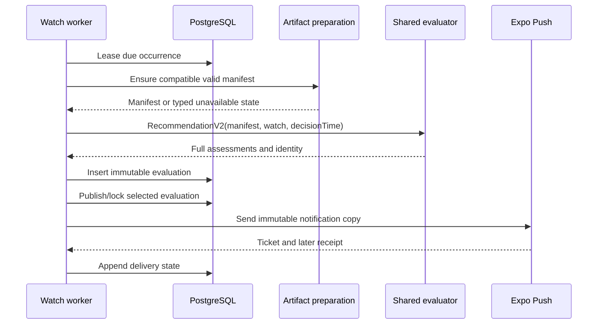

# System design: client/server planning architecture

- Status: proposed target architecture
- Scope: Algorithms 1–7, mobile, web, API, background evaluation, persistence,
  and notifications
- Current-production reference: [`../architecture.md`](../architecture.md)

## Executive decision

Runcast should remain a local-first planner backed by a modular server, with one
versioned deterministic evaluation engine shared by Hermes, browsers, and Node.
The server should prepare authoritative, expensive, reusable inputs. The client
should evaluate those inputs at the user's selected pace and start time without
a network round trip. The server should run the same evaluator for unattended
watches and persist immutable recommendation snapshots.

The boundary is:

```text
Server: ingest, validate, enrich, normalize, cache, reduce uncertainty, govern
                                      ↓
       immutable/versioned route + environment + forecast artifacts
                                      ↓
Client: cache, evaluate a run, scrub time, compare starts, explain, render

Server worker: evaluate the same artifacts for watches, snapshot, notify
```

This is deliberately not a “move all sophisticated math to the cloud” design.
Haversine/geodesic lookup, timing integration, interpolation, solar position,
vector projection, comfort evaluation, and a bounded recommendation scan are
fast arithmetic when their inputs are already prepared. They belong close to
the interaction. Provider I/O, large-raster/geospatial work, official-alert
integration, full ensembles, calibration, persistence, and background
execution belong on the server.

The target deployment is still a modular monolith plus worker and PostgreSQL.
No microservice split, Redis cluster, or independent model-serving fleet is
justified yet. Component boundaries should exist in code and artifacts first;
process boundaries should follow measured scaling or isolation needs.

## What “one modular API” means

Runcast exposes one public Fastify API service and one API base URL. Inside that
service, code is divided into cohesive domain modules—for example identity and
route import, planning bundles, watches/devices, and forecast normalization.
Each module owns typed handlers, application logic, persistence access, and
tests for its domain. Modules call one another through TypeScript interfaces or
application functions inside the process, not through private HTTP endpoints.
The seven algorithms do not become seven API modules; they remain composable
layers in `@runcast/core`, while API modules orchestrate ownership, input
preparation, persistence, and delivery.

This is one deployable API, not one undifferentiated code unit. The scheduled
worker/cron is a separate execution mode built from the same repository and
container image; it reuses the same domain modules and `@runcast/core` rather
than duplicating server logic. Both modes use PostgreSQL. There is no current
need for a service per algorithm, a network queue, Redis, object storage, or a
model server.

The module boundaries still matter: they keep ownership and tests clear, stop
forecast-provider code from leaking into request handlers, and provide a safe
place to split a process later if measured scaling or isolation evidence ever
justifies it.

### Why retain Fastify

Fastify is a continuity choice, not a claim that the system depends on a unique
Fastify capability. Runcast already has working Fastify route modules and uses
its request logging/redaction, body limits, compression, CORS, rate limiting,
health endpoints, OpenAPI integration, error handling, and in-process test
support. Replacing it would consume migration and regression effort without
improving the seven selected algorithms or the client/server boundary.

Framework throughput is not the deciding bottleneck. Provider latency,
database access, artifact preparation, and scheduled evaluation dominate the
important server paths. The framework should therefore be reconsidered only
for a concrete runtime, deployment, maintainability, or scaling requirement.

| Option                         | Strengths                                                                                                                                                     | Why it is not the current choice                                                                                                                                    |
| ------------------------------ | ------------------------------------------------------------------------------------------------------------------------------------------------------------- | ------------------------------------------------------------------------------------------------------------------------------------------------------------------- |
| **Fastify (retain)**           | Existing implementation; explicit plugin/module boundaries; built-in request lifecycle; current logging, validation-adjacent, OpenAPI, and test integrations. | Best fit without a rewrite; its main risk is allowing route plugins to become thin names over tangled shared logic, which the domain-module boundary addresses.     |
| **Express**                    | Extremely familiar, broad middleware ecosystem, simple mental model.                                                                                          | A migration would add little product value and require rebuilding the controls Runcast already has around schemas, errors, logging, tests, and plugins.             |
| **NestJS**                     | Strong module/DI conventions and team-scale structure.                                                                                                        | More decorators, containers, and framework ceremony than this small modular monolith needs; useful only if team and domain complexity grow substantially.           |
| **Hono**                       | Small Web-standards API and good portability to edge-style runtimes.                                                                                          | Runcast currently targets Node with PostgreSQL and scheduled work; edge portability is not a requirement, and existing Fastify integrations would need replacement. |
| **Raw Node HTTP**              | Maximum control and minimal framework dependency.                                                                                                             | Runcast would own routine routing, lifecycle, validation integration, logging, limits, documentation, and test plumbing with no user-visible benefit.               |
| **Serverless/route functions** | Independent scaling and convenient deployment in some hosting platforms.                                                                                      | They fragment the modular API, complicate shared initialization and scheduled/provider-heavy work, and solve no measured scaling problem today.                     |

`tRPC` or GraphQL could change the API contract style, but they are not required
to achieve end-to-end type safety. Runcast already shares explicit Zod-backed
contracts across clients and the REST API, which also keeps the boundary easy
to inspect, cache, and exercise outside TypeScript.

**Portfolio decision:** retain Fastify. The resume value should come from the
system around it—typed contracts, explicit module boundaries, shared
deterministic evaluation, local latency budgets, durable background work,
immutable notification snapshots, and measured correctness—not from replacing
a suitable framework for another name. If learning NestJS or an edge runtime
becomes a separate career objective, prove it in a bounded adapter or separate
project rather than rewriting Runcast without a product requirement.

## Delivery profile: sophisticated domain, restrained system

This document is an architectural envelope, not a commitment to implement
every described component. Unless an ADR supported by measurements promotes a
capability, the portfolio/resume implementation is the default scope below.

### Portfolio/MVP scope

Build one coherent vertical slice:

1. retain one modular Fastify API and the existing scheduled worker/cron from
   the same repository and deployment image;
2. retain PostgreSQL as the only required server data system;
3. retain `@runcast/core` as the shared deterministic evaluator on mobile,
   browser, and Node;
4. expose one owner-scoped, versioned planning-bundle response containing the
   existing route, coverage/environment input, server-normalized weather,
   quality/validity metadata, and model/policy versions;
5. validate and cache that bundle on mobile, then keep start-time and pace
   evaluation local and network-free;
6. make scheduled recommendation inputs and published notification snapshots
   reproducible and immutable;
7. benchmark the client calculation and server watch path, and report the
   measured result rather than claiming theoretical scale.

The route, environment, forecast, and safety sections remain logically
identified inside the bundle, but the MVP may transport and persist them as
one compressed JSON document. Logical artifact boundaries are valuable for
versioning and tests; they do not initially require separate URLs, database
tables, services, or storage products.

### Current cross-plan algorithm commitment

The architecture slice supports only the following selected algorithm work.
This table is the implementation contract; the rest of Plans 1–7 is retained
for design context and future evidence-gated decisions, not as an active
backlog.

| Algorithm                    | Implement now                                                                                                               | Deferred reference options                                                              |
| ---------------------------- | --------------------------------------------------------------------------------------------------------------------------- | --------------------------------------------------------------------------------------- |
| 1. Route geometry and timing | Preserve segments, represent missing elevation, validate bounded imports, and emit quality metadata.                        | Advanced DEM/global geometry and higher-order spatial models.                           |
| 2. Grade-adjusted pace       | Version the model, define pace/effort semantics, and apply a quality-aware flat fallback.                                   | Field-trained, fatigue-aware, or personalized models.                                   |
| 3. Weather interpolation     | Correct temporal semantics, validity, and missingness; normalize authenticated forecasts on the server.                     | Full ensembles, learned downscaling, and terrain-specific systems.                      |
| 4. Solar exposure and canopy | Correct sunrise math, multipolygon behavior, unknown coverage, and radiation semantics.                                     | Lidar, full 3D occlusion, and advanced ray tracing.                                     |
| 5. Runner-relative wind      | Correct runner-relative vectors and apparent airflow while keeping ambient wind and aerodynamic effect distinct.            | Street-level downscaling, CFD, and learned shielding.                                   |
| 6. Comfort scoring           | Separate safety, physical load, and preference; integrate over time; prohibit hazard compensation.                          | Physiological simulation and learned personalization.                                   |
| 7. Best-start recommendation | Filter unsafe/unactionable candidates, return unavailable/no-suitable states, persist immutable snapshots, and rank stably. | Full probabilistic optimization, extensive personalization, and ensemble-driven search. |

Completion of this vertical slice does not promote a deferred item. Any scope
expansion requires an explicit decision and must still satisfy the activation
evidence and complexity budget below.

### Conditional capabilities, not backlog commitments

| Capability                                    | Activation evidence required                                                                                                   | Default until then                                                 |
| --------------------------------------------- | ------------------------------------------------------------------------------------------------------------------------------ | ------------------------------------------------------------------ |
| Separate manifest/artifact endpoints          | Bundle transfer, invalidation, or parse metrics miss an agreed budget because static route data is repeatedly transferred      | Keep one versioned bundle endpoint with ETag and compression       |
| Object storage                                | PostgreSQL artifact volume, backup time, I/O, or response latency breaches a measured operating budget                         | Keep bounded JSONB/current storage                                 |
| Dedicated queue or Redis                      | Database-leased jobs or the current cron miss watch readiness/concurrency SLOs for sustained load                              | Keep PostgreSQL coordination and in-process request coalescing     |
| Separate GIS worker/service                   | Native dependencies, memory isolation, or measured CPU/queue contention cannot be safely contained in the existing worker      | Keep preparation as modules in the existing deployment             |
| Full ensembles and compact-scenario reduction | Hindcasts show calibrated uncertainty materially improves regret/safety and both server cost and device latency meet budgets   | Keep deterministic forecasts with honest limited-confidence states |
| Official-alert expansion                      | A region has authoritative coverage, reviewed semantics, operational ownership, and reliable ingestion                         | Do not imply authoritative alert coverage                          |
| Learned personalization                       | Consented data, governance, held-out gain, deletion support, and safety non-regression are demonstrated                        | Use explicit preferences and population defaults                   |
| Microservices/model serving                   | A measured scaling, fault-isolation, team-ownership, or deployment constraint cannot be solved cleanly in the modular monolith | Keep one API plus worker and PostgreSQL                            |

### Complexity budget

The initial system may add domain contracts, tests, and metadata, but it should
not add another production infrastructure dependency. Any proposal for a new
process, datastore, artifact transport, or model runtime must name:

- the observed bottleneck or reliability failure;
- why the modular monolith cannot meet the budget;
- the operational owner and rollback path;
- the user-visible improvement;
- the metric that permits removal if the added complexity does not pay for
  itself.

For the portfolio story, completing the small vertical slice with measured
latency, offline behavior, deterministic cross-runtime output, and immutable
notifications is more valuable than partially implementing every advanced
module below.

## Why a cross-cutting design is required

The seven algorithm plans are individually strong but share contracts that
cannot be decided independently:

- route revisions determine every downstream cache key;
- weather validity determines whether any candidate can be evaluated;
- exposure, wind, and comfort need common interval weights and uncertainty;
- safety policy must constrain both interactive and scheduled recommendations;
- mobile and Node must interpret the same artifact and policy versions;
- notification snapshots must remain explainable after models and forecasts
  change;
- latency limits determine whether uncertainty can be evaluated locally or
  must be reduced on the server.

Without an explicit boundary, each algorithm could add its own fetch path,
quality vocabulary, cache, version field, and fallback. That would preserve the
appearance of a shared engine while making results irreproducible.

## Goals

1. Preserve immediate, offline-capable interaction after data is cached.
2. Produce the same material result from the same versioned inputs on mobile,
   web, and server.
3. Prevent missing, stale, or out-of-range inputs from becoming falsely safe
   values.
4. Make every recommendation and notification reproducible and auditable.
5. Support the stronger geometry, weather, exposure, wind, comfort, safety,
   and uncertainty models proposed by Algorithms 1–7.
6. Keep exact routes and user preferences within an explicit consent and
   ownership boundary.
7. Scale provider and geospatial work by reuse rather than by weakening model
   resolution.
8. Introduce the architecture incrementally while V1 clients and snapshots
   remain readable.

## Non-goals

- Runcast is not a real-time lightning detector, emergency alert service, or
  medical heat-safety system.
- The design does not guarantee identical provider coverage worldwide.
- The server will not receive every guest GPX automatically.
- The client will not execute arbitrary model code downloaded from the server.
- The first implementation will not add services merely to mirror conceptual
  modules.
- Logical artifacts do not require one endpoint or database table per artifact
  in the first implementation.
- Full computational-fluid-dynamics, raw ensemble archives, model training,
  and raster processing will not run on a phone.
- A recommendation is not allowed to become available by silently degrading
  missing safety inputs.

## Current-state assessment

The current shape has several good foundations:

- `@runcast/core` is pure TypeScript and is used by mobile, web, and the API.
- `computePlan` is synchronous and bounded to at most 500 route samples.
- the clients fetch a multihour field once and recompute locally while the user
  changes the start time;
- authenticated route bundles already use a strict `@runcast/contracts` schema,
  ETags, SQLite caching, and owner-scoped API access;
- Strava and Apple identities resolve to one provider-neutral Runcast UUID that
  owns product data; identities are unique, linkable, and never merged
  automatically;
- Strava sign-in uses hashed single-use OAuth state and returns a short-lived,
  hashed, device-bound exchange code rather than Runcast tokens in a deep link;
- the worker reuses `recommendStart`, caches weather per route during a run,
  persists the engine version, and de-duplicates notification delivery;
- guest GPX files are not automatically saved to Runcast.

The production system is not yet the target described in this document:

- guest mobile and web call Open-Meteo and public Overpass directly;
- authenticated mobile also independently fetches weather for planner state,
  so server and device inputs may differ;
- the existing route bundle is a single mutable aggregate with limited
  provenance, no evaluator compatibility contract, and `weather: null` as its
  only preparation state;
- a 30-minute freshness TTL is treated as if it were forecast validity;
- provider nulls and horizon gaps can still be converted or clamped into values;
- route, weather, coverage, and model versions are not independently identified;
- `ENGINE_VERSION` combines several lifecycles into one string;
- the scheduler can consider elapsed starts and currently upserts the same
  recommendation row after a notification may reference it;
- full candidate assessments, input identity, safety policy, and supersession
  history are not persisted;
- direct guest fetching means “not uploaded to Runcast,” not “coordinates never
  leave the device”: forecast anchors go to Open-Meteo and the route bounding
  area goes to Overpass. That distinction must be disclosed.

This design keeps the good foundations and replaces the ambiguous boundaries.

## Commit alignment review: `b8600e3`

The system design was reviewed against `b8600e3` (`Implement Strava-first
authentication`, 2026-07-18). The commit changes identity, consent, migration,
and route acquisition; it does not change the seven planning algorithms.

### What aligns

- A provider-neutral Runcast UUID, rather than an Apple subject or Strava
  athlete ID, owns routes, preferences, watches, sessions, and devices. This is
  the correct owner for every future manifest, artifact, evaluation, and cache
  namespace.
- Provider identities are unique and explicitly linked. The implementation
  rejects collisions rather than automatically merging two stores of sensitive
  route data.
- Guest planning remains available and no guest route is automatically saved.
- Strava sign-in and Strava linking use single-use hashed state. Sign-in returns
  a five-minute, hashed, device-bound, single-use exchange code and performs
  the Runcast token exchange over HTTPS.
- A Strava route is listed and imported only after an explicit user action.
  Authentication or provider linking does not itself create a saved route.
- Account deletion attempts provider revocation and then cascades the
  provider-neutral account data; sign-out removes a session without deleting
  the account or imported routes.

### Gaps exposed by the review

1. **Offline identity/link state is not yet a durable client state.**
   `authProviders` and `stravaConnected` initialize in memory and are refreshed
   from two API calls. On an offline cold start, cached routes remain usable but
   the account UI can fall back to incomplete provider/link descriptions. Plan
   8 therefore requires validated last-known identity and connection metadata,
   with `fetchedAt` and explicit offline/stale presentation. Cached identity is
   display/sync state only; it never authorizes an API operation.
2. **The new primary Strava path still terminates in Route V1.** The API reads
   the complete provider response into a string, uses the existing parser, and
   checks the point cap after parsing. The geometry, missing-elevation,
   topology, resource-bound, and reprocessing concerns remain. Plan 1 now
   treats this provider path as a required ingestion fixture and requires a
   streamed byte bound.
3. **Identity, provider access, import, cloud retention, and research consent
   are distinct.** Strava OAuth may enable sign-in and listing, but it is not
   consent to import every route, retain original exports indefinitely, enrich
   unrelated routes, or train personalization models. The artifact design must
   preserve those separate decisions.
4. **The beta migration is intentionally destructive.** Migration `0003`
   deletes prior authenticated beta users rather than inferring neutral
   identities. That is an explicit beta reset, not an acceptable migration
   pattern for Route/Manifest V2. Future algorithm migrations must preserve
   owned data, leave legacy artifacts readable, or require an individually
   explained re-import; they may not solve versioning by deleting accounts.
5. **Provider disconnection changes reprocessing capability, not route
   ownership.** An already imported route remains owned by the Runcast UUID.
   If its original Strava export is unavailable after disconnection, the route
   must be labeled legacy/non-reprocessable rather than silently refetched,
   recanonicalized, or deleted.

### Resulting plan changes

Plans 2–7 require no change because the commit does not touch their inputs,
equations, policies, or outputs. Plan 1 receives stronger provider-ingestion
and source-retention gates. Plan 8 now makes neutral ownership, separate consent
states, durable last-known account metadata, non-destructive algorithm
migration, and provider-disconnection behavior explicit.

## Architectural principles

### 1. Keep one evaluator, not one undifferentiated package

The domain logic should remain pure and portable, but split into explicit
layers with separate version lifecycles:

```text
canonical route and prepared profiles
  -> timing evaluator
  -> environmental sampler
  -> physical-condition and exposure evaluator
  -> safety policy
  -> preference/performance model
  -> recommendation policy
```

“Shared engine” means the same typed functions and pinned parameters execute in
all runtimes. It does not mean provider clients, persistence, UI formatting,
model training, or geospatial preprocessing belong in `@runcast/core`.

### 2. Artifacts, not hidden server state

Every evaluation consumes immutable artifacts identified by content and
version. A mutable database row may point to the latest artifact, but an
already-published plan or recommendation continues to point to the exact
artifact set it used.

### 3. Freshness is not validity

Each forecast-like artifact has separate fields for:

- provider issue/model-run time;
- fetch time;
- valid interval by variable;
- `staleAt`, which triggers refresh;
- `expiresAt`, after which decision use is prohibited;
- quality and fallback reasons.

A stale artifact may support clearly labeled exploration if all evaluated
instants remain inside its validity interval. An expired or incomplete artifact
cannot produce an eligible recommendation.

### 4. Unknown remains unknown

Missing elevation, precipitation probability, alert coverage, canopy evidence,
or forecast horizon must remain typed missing data. Conservative policy may
turn an unknown into `unavailable`, `caution`, or a named fallback; it must not
turn it into numeric zero, open ground, or safety.

### 5. Safety is lexicographically prior to preference

The safety layer returns eligibility and reason codes. Comfort, convenience,
and personalization rank only within the policy-permitted set. No weighted sum
can compensate for a blocking condition.

### 6. The network is never in the gesture loop

Dragging the start-time control, changing pace, reversing a route, moving
playback, or inspecting a sample must not wait on the API. The UI uses the last
atomically installed compatible artifact set and refreshes it in parallel.

### 7. Persist inputs before claims

If Runcast cannot identify the route revision, normalized forecast, spatial
evidence, evaluator version, policies, and decision time behind a scheduled
claim, it should not send that claim as a notification.

## Overall current-scope architecture

```mermaid
flowchart LR
  subgraph Client[Mobile or web client]
    UI[Planner, route import, watches, explanations]
    Cache[(Validated local planning-bundle cache)]
    ClientCore[@runcast/core in Hermes or browser]

    UI -->|guest route, pace, start time, direction| ClientCore
    Cache --> ClientCore
    ClientCore -->|plan, recommendation, reasons| UI
  end

  subgraph Server[Runcast server: one repository and deployment image]
    subgraph API[One public Fastify API service]
      Gateway[HTTP routing, auth, validation, observability]
      IdentityRoutes[Identity and route import module]
      Bundles[Planning-bundle module]
      Watches[Watches and devices module]

      Gateway --> IdentityRoutes
      Gateway --> Bundles
      Gateway --> Watches
    end

    Normalize[Forecast and coverage normalization module]
    Worker[Scheduled worker or cron]
    ServerCore[@runcast/core in Node]

    Bundles --> Normalize
    Worker -->|refresh inputs| Normalize
    Worker -->|evaluate due watches| ServerCore
  end

  DB[(PostgreSQL: ownership, bundles, watches, immutable snapshots)]
  Strava[Strava API]
  Weather[Weather provider]
  OSM[OSM coverage provider]
  Push[Expo Push]

  UI -->|HTTPS setup, sync, explicit import| Gateway
  Bundles -->|versioned bundle and ETag| Cache

  IdentityRoutes -->|explicit route import| Strava
  Normalize -->|bounded forecast fetch| Weather
  Normalize -->|bounded coverage fetch| OSM

  IdentityRoutes --> DB
  Bundles --> DB
  Watches --> DB
  Normalize --> DB
  Worker -->|lease work and persist immutable result| DB

  Worker -->|immutable notification copy| Push
  Push --> UI

  ClientCore -. same versioned deterministic package .-> ServerCore
```

The boxes inside the Fastify boundary are logical modules, not independently
deployed services. The only network-facing application service is the API; the
worker is a scheduled execution path from the same build. PostgreSQL remains
the only required server datastore. Once a bundle is cached, planner gestures
and bounded recommendation evaluation follow the client-only loop at the top
of the diagram.

## Work-placement decisions

| Capability             | Server responsibility                                                                                                            | Client responsibility                                                                              | Reason                                                                                                      |
| ---------------------- | -------------------------------------------------------------------------------------------------------------------------------- | -------------------------------------------------------------------------------------------------- | ----------------------------------------------------------------------------------------------------------- |
| GPX and route geometry | Canonicalize saved routes, preserve topology, validate, enrich elevation, create immutable prepared profiles                     | Parse a guest preview, choose ambiguous parts, render a presentation mesh, reverse/inspect locally | Saved geometry must be reproducible and enrichment is provider-heavy; local preview preserves guest utility |
| Grade-adjusted timing  | Prepare quality-aware elevation/grade profiles and publish model parameters/versions; fit models off-line                        | Integrate timing for selected pace/effort and produce arrival times                                | Integration is cheap and changes with user input; enrichment and fitting are not                            |
| Weather                | Select anchors/cells, call providers, retain raw identity, normalize temporal semantics, validate, cache, and reduce uncertainty | Interpolate the prepared field at route arrival points                                             | Provider I/O and provenance are reusable; interpolation must stay responsive                                |
| Solar and shade        | Build terrain/building/canopy evidence and directional occlusion profiles; publish radiation inputs                              | Compute solar position for selected time and compare it with prepared occlusion/radiation data     | Large GIS/raster work is expensive; solar geometry is cheap and time-dependent                              |
| Wind                   | Normalize forecast vectors and prepare runner-height/exposure descriptors                                                        | Compute route-relative and runner-relative vectors, apparent airflow, and per-interval load        | The vector calculation changes with route direction and pace but is inexpensive                             |
| Comfort/performance    | Govern model and policy versions, train/calibrate with consented data, distribute bounded parameters                             | Evaluate time-integrated load, conditions fit, and explanations                                    | Keeps interaction local while preventing uncontrolled model drift                                           |
| Safety                 | Integrate authoritative alert context where available, define centrally versioned policy, audit it                               | Apply the policy to the exact run interval and render eligibility/reasons without weakening it     | Alert acquisition is regional/server-side; overlap depends on local start and arrival times                 |
| Best start             | Run full-ensemble/oracle evaluation, scheduled watches, and immutable publication                                                | Run bounded interactive search over a compact scenario set                                         | Interactive changes need low latency; unattended decisions need server reliability and stronger uncertainty |
| Personalization        | Store consent, learn guarded parameters, enforce deletion/governance                                                             | Hold current explicit preferences and apply compatible parameters                                  | Training and governance are server concerns; evaluation is small                                            |

### Computation that must remain on device

The following are gesture-critical or user-input-specific:

- route reversal and presentation lookup;
- arrival-time integration for a new pace or effort selection;
- one `computePlanV2` for a selected start;
- sample/band/split summaries;
- solar position at the runner's arrival time;
- route- and runner-relative wind;
- policy and comfort evaluation from cached inputs;
- a bounded recommendation scan when route, speed, effort, preferences, or
  window changes;
- rendering, playback, and explanation selection.

The recommendation scan must not be a dependency of each slider frame. A
slider change computes one plan. Recommendation recomputation occurs only when
an input to the search changes, and its result may update asynchronously.

### Computation that must remain on the server

- authentication, provider credentials, ownership, sessions, and push tokens;
- saved-route canonicalization and reprocessing;
- DEM/elevation acquisition and datum normalization;
- building, terrain, canopy, multipolygon, and directional-occlusion work;
- forecast selection, acquisition, validation, normalization, provenance, and
  cache coordination;
- official-alert ingestion and coverage policy;
- full ensemble retention and expensive scenario/oracle evaluation;
- model fitting, calibration, bias monitoring, and rollout governance;
- watch scheduling, immutable recommendation publication, delivery, retry, and
  receipt reconciliation;
- reproducibility records, audit data, and privacy-reviewed telemetry.

## The planning artifact model

### Why the current single bundle is insufficient

Route geometry changes rarely, spatial evidence changes occasionally, and
weather changes frequently. Returning all three as one mutable JSON object
can make it unclear which dependency invalidated a result and may redownload
static route data whenever a forecast refreshes. Splitting transport too early,
however, creates more endpoints, cache states, and failure combinations before
that transfer cost is known.

`RouteForecastBundleV2` should therefore be a logical bundle: one immutable
manifest that pins independently identifiable artifacts. The MVP transports
them together. Independent caching becomes an optimization only if measurements
activate it; their identities and schemas remain separate either way.

```ts
type QualityStatus = 'complete' | 'partial' | 'unavailable';

interface QualityEnvelope {
  status: QualityStatus;
  reasonCodes: string[];
  warnings: string[];
  sourceIds: string[];
}

interface ArtifactRef {
  artifactId: string;
  schemaVersion: string;
  contentHash: string;
  byteLength: number;
  etag: string;
}

interface EvaluatorCompatibility {
  evaluatorVersion: string;
  minimumReaderVersion: string;
  routeModelVersion: string;
  timingModelVersion: string;
  weatherNormalizerVersion: string;
  exposureModelVersion: string;
  windModelVersion: string;
  physicalLoadModelVersion: string;
  preferenceModelVersion: string;
  safetyPolicyVersion: string;
  recommendationPolicyVersion: string;
}

interface PlanningManifestV2 {
  schemaVersion: 'planning-manifest.v2';
  manifestId: string;
  routeId: string;
  routeRevisionId: string;
  generatedAt: number;
  staleAt: number;
  expiresAt: number;
  validRange: { start: number; end: number };
  quality: QualityEnvelope;
  compatibility: EvaluatorCompatibility;
  artifacts: {
    route: ArtifactRef;
    environment: ArtifactRef;
    forecast: ArtifactRef;
    safetyContext: ArtifactRef | null;
    compactScenarios: ArtifactRef | null;
  };
}
```

These names are a design contract, not a demand to implement every field in
one change. Exact Zod schemas and units must be frozen in an ADR before code.

### Prepared route artifact

The route artifact is independent of start time and weather. It should contain:

- the selected continuous `PlannableRouteV2` revision;
- canonical distance model and coordinate/elevation provenance;
- geometry profile and interval boundaries;
- timing integration profile with elevation confidence;
- environmental evaluation mesh with interval weights;
- a separately capped presentation mesh;
- timezone evidence and route-quality diagnostics;
- content identity for the original or reprocessable source, when retention is
  consented and policy permits it.

It must not use `ele: 0` to represent absence. It must not silently join GPX
segments. A route revision is immutable because changing cumulative distance
invalidates every downstream artifact.

### Environment artifact

This slower-changing artifact contains route-position-dependent context:

- land-cover/canopy evidence with source, acquisition time, resolution, and
  unknown regions;
- terrain/building horizon or occlusion descriptors by direction, rather than
  a precomputed “shade” label for one instant;
- runner-height wind exposure/roughness descriptors, if validated;
- surface/altitude/context fields used by a supported timing or load model;
- the spatial mesh and interpolation policy each descriptor expects.

Precomputing a compact horizon profile lets the phone answer a time-dependent
question cheaply: compare local solar elevation/azimuth with the prepared
directional horizon. It avoids raster or building ray tracing on every scrub.

### Forecast artifact

The forecast artifact contains normalized, evaluator-ready data rather than an
unvalidated provider response:

- provider, model, run, issue, fetch, and license/attribution identity;
- requested and actual coordinate/elevation cells;
- variable-specific interval semantics and valid ranges;
- primitive fields needed once by downstream physics;
- categorical hazards preserved without interpolation;
- missingness masks and named fallbacks;
- uncertainty metadata and, when available, ensemble/scenario identity;
- timezone as display metadata, never as an alternative timestamp system.

Raw provider payloads should be retained only according to a documented
license, cost, privacy, and replay policy. The normalized artifact must contain
enough identity to reproduce its transformation.

### Safety-context artifact

This artifact contains regional context that is not equivalent to a weather
code:

- official alert polygons/regions, validity intervals, severity, source, and
  update identity where coverage exists;
- an explicit `coverageAvailable` state by route interval and time;
- product policy inputs that cannot be reconstructed from forecast variables;
- no claim of authoritative coverage where the integration is unavailable.

The client evaluates overlap with the run's position/time intervals. Lack of
official-alert coverage may be informational, cautionary, or blocking depending
on the separately versioned product policy; it is never silently “no alerts.”

### Compact uncertainty scenarios

Full ensembles can multiply work dramatically. For example, a 48-hour window
on a 15-minute grid is about 193 candidates. At 500 environmental samples and
30 ensemble members, one recommendation is approximately 2.9 million
sample-scenario evaluations before refinements.

The server should retain/evaluate the full supported ensemble when justified,
then publish a small set of coherent, weighted scenarios for interactive use.
Reduction must preserve cross-variable, spatial, and temporal correlation; it
must not independently combine marginal percentiles into physically impossible
weather. The compact set is validated against the full ensemble for hazard
probability, candidate ordering, and regret.

Do not freeze a scenario count by intuition. Establish the maximum from mobile
benchmarks and approximation error. If no compact set meets both criteria, the
client shows deterministic/limited-confidence exploration and requests a
server-computed robust recommendation outside the gesture path.

## Evaluation contracts

The bundle intentionally excludes user-specific `startTime`, pace, effort, and
preference values so it can be cached and reused. Those enter the evaluator:

```ts
interface PlanEvaluationInputV2 {
  routeId: string;
  routeRevisionId: string;
  manifestId: string;
  startTime: number;
  referenceSpeed: number;
  paceReferenceSemantics: string;
  effortIntent: string;
  preferenceProfileVersion: string;
  decisionTime: number;
}

interface EvaluationIdentity {
  manifestId: string;
  routeRevisionId: string;
  inputHash: string;
  compatibility: EvaluatorCompatibility;
}
```

`RunPlanV2` should return:

- interval-weighted samples/features and summaries;
- physical conditions separately from preference utility;
- safety eligibility and machine-readable reason codes;
- quality, uncertainty, fallback, and resolution-limit diagnostics;
- explanation features derived from the same result, not recomputed in UI;
- `EvaluationIdentity` echoed verbatim.

`RecommendationV2` should follow Algorithm 7's typed states:
`recommended`, `caution`, `no-suitable-window`, or `unavailable`; a nullable
winner; alternatives; evaluated and unevaluable candidates; confidence;
reason codes; and the full evaluation identity.

### Determinism boundary

For the same artifacts, input, evaluator version, and policy versions:

- candidate timestamps, eligibility, reason codes, and winner must match across
  supported runtimes;
- scalar results must match within a documented serialization tolerance;
- ordering may not depend on object iteration, locale, wall-clock calls, random
  seeds, or unstable floating-point tie behavior;
- all randomness used for scenario reduction or probabilistic evaluation is
  performed server-side or supplied as a fixed versioned scenario artifact;
- `Date.now()` is forbidden inside pure evaluation. `decisionTime` is input.

Bit-for-bit floating-point equality across Node and Hermes is not assumed until
proven. Decision equivalence and bounded numeric tolerances are the release
contract.

## API design

Keep `/v1/routes/:id/bundle` unchanged for V1 clients. Add a genuinely versioned
V2 boundary rather than adding incompatible required fields to strict V1 Zod
objects.

MVP resources:

```text
GET  /v2/routes/:id/planning-bundle
POST /v2/routes/gpx
GET  /v2/route-imports/:importId
GET  /v2/recommendations/:evaluationId
```

The planning-bundle response contains a manifest header and its logically
separate route/environment/forecast/safety payloads in one compressed response.
If measured transfer or invalidation cost later justifies fan-out, preserve the
same schemas and add conditional resources such as:

```text
GET /v2/routes/:id/planning-manifest
GET /v2/routes/:id/artifacts/:artifactId
```

The exact route names may change during contract review. Required behavior is:

- every request remains owner-scoped;
- planning bundles support ETag/`If-None-Match`; split artifacts must do the
  same if that optimization is activated;
- logical artifact identities are immutable and content-verified even when
  their payloads are transported together;
- a client advertises its supported evaluator/schema versions;
- the server returns a compatible manifest or a typed
  `CLIENT_UPDATE_REQUIRED`, never data with silently changed semantics;
- a missing prepared artifact returns `202 preparing` with retry guidance, not
  `200` with ambiguous nulls;
- a provider failure returns a typed state and may return a still-valid stale
  manifest separately;
- if artifact URLs are later introduced, the URL is not authorization. Every
  fetch checks ownership even when the identifier is content-derived.

### Preparation state machine

```text
missing -> preparing -> ready -> stale -> expired
              |          |        |
              v          v        v
            failed    degraded  unavailable-for-decision
```

Freshness and quality are orthogonal. `degraded` means a named optional input
or supported fallback is active. It cannot conceal a required safety or
validity gap.

Recommended response behavior:

| State                             | Planner display                                      | Recommendation eligibility                        | API behavior                             |
| --------------------------------- | ---------------------------------------------------- | ------------------------------------------------- | ---------------------------------------- |
| Ready and valid                   | Full                                                 | Allowed subject to safety                         | `200` bundle/manifest                    |
| Stale but valid                   | Labeled, refresh in background                       | Policy-controlled; watches normally refresh first | `200` plus stale state                   |
| Degraded with supported fallback  | Labeled limitations                                  | Caution or allowed by explicit policy             | `200` plus reason codes                  |
| Preparing with no prior valid set | Route/timing preview only                            | Unavailable                                       | `202` plus retry guidance                |
| Expired/outside validity          | Historical/stale view only                           | Unavailable                                       | Typed unavailable state                  |
| Failed with prior valid set       | Continue within prior validity, show refresh failure | Never extend validity                             | Valid prior manifest plus error metadata |

### Atomic client installation

For the MVP, the client downloads one planning bundle, validates every nested
Zod schema, checks logical hashes and compatibility, writes a new cache record,
and atomically makes it current. If artifacts are later split, it fetches
missing payloads by ID and promotes the manifest only after all required
artifacts succeed. In both designs, a partial refresh never mixes a new
forecast with an old route revision or safety context.

## Client design

### Local data layers

The mobile cache should distinguish:

1. validated last-known provider-neutral account, identity/link metadata, and
   mutable sync state, each with freshness/offline status;
2. route summaries and immutable route revisions;
3. immutable artifacts keyed by artifact ID;
4. current manifest pointers keyed by user and route;
5. optional local evaluations keyed by manifest and user-input hash;
6. pending user mutations and conflicts.

Every cached artifact is parsed on read or before promotion. A corrupt or
unsupported artifact is evicted and refetched; it is not passed into core as an
unchecked TypeScript assertion. Cache-directory placement can remain, so the
OS may evict data and backups do not retain sensitive routes.

The MVP may store the complete planning bundle as one validated cache entry.
The artifact IDs inside it preserve lineage and future migration options; they
do not require a normalized local artifact store until measurements justify
independent downloads.

### Interaction scheduling

- Start-time scrubbing evaluates one plan from the installed manifest.
- Expensive recommendation scans are memoized independently of selected
  `startTime`.
- Pace/effort, direction, route, preference, window, manifest, or policy changes
  invalidate recommendation results.
- Superseded async calculations are ignored by generation ID or cancellation.
- The last valid plan remains visible during refresh, labeled with its age and
  quality.
- UI animation and map work must not be coupled to provider fetch completion.
- If profiling shows core work blocks the supported UI budget, move the bounded
  recommendation scan off the critical render path before reducing model
  correctness. The single-plan path remains prioritized.

### Guest mode

Guest mode remains useful without an account:

```text
GPX selected by user
  -> local parse/canonical preview
  -> direct provider requests for weather/coverage
  -> local normalization and V1/V2-compatible evaluation
  -> local-only cache
```

Guest limitations must be honest:

- no Runcast background watches or push;
- no server elevation/geospatial enrichment unless the user explicitly opts to
  send route-derived data;
- direct provider requests disclose anchor coordinates or bounding regions to
  those providers and expose the user's IP under their policies;
- public Overpass remains best effort and unknown coverage stays unknown;
- the embedded client may use an older model until the app is updated;
- offline use works only within the validity of already cached data.

An anonymous proxy is not automatically more private: it hides the client IP
from providers but sends route-derived coordinates to Runcast and introduces
abuse, logging, and retention concerns. Treat that as a separate privacy ADR.

### Authenticated mode

Saving or importing a cloud route is an explicit consent boundary. The server
stores and prepares that route; mobile consumes server artifacts and should no
longer independently fetch a second production weather field for the same
saved route.

The authentication provider does not become the data owner. All API and cache
ownership uses the stable Runcast UUID. Linking a second identity never merges
accounts automatically, and changing or disconnecting a provider cannot move
artifacts between owners.

Strava sign-in/provider access and route import are separate actions. Only an
explicitly imported or saved route enters route preparation. Original-export
retention, geospatial enrichment, and model-training use require their own
documented policy or consent; they are not implied by authentication.

On open:

1. render the validated cached manifest immediately;
2. conditionally fetch the latest manifest;
3. download only changed artifacts;
4. atomically promote the compatible set;
5. recompute the plan locally;
6. show freshness/quality changes if they materially alter the result.

If offline, a valid cached manifest supports ordinary local interaction. Once
the forecast validity ends, the route and timing view remain available, but
weather-dependent recommendations become `unavailable`; sampling must not
clamp to the last forecast hour.

## Server design

### Modules inside the existing deployment

The first target implementation should use these code boundaries:

```text
API adapters
  auth / ownership / routes / manifests / artifacts / watches

Preparation services
  route canonicalizer
  elevation profiler
  forecast provider adapters + normalizer
  spatial evidence / occlusion builder
  official-alert adapter
  compact-scenario builder

Domain evaluator
  pure shared core and versioned policies

Background workflows
  artifact materialization and refresh
  watch occurrence evaluation
  notification publication / retry / receipt reconciliation

Persistence
  repositories for mutable product state and immutable artifacts/snapshots
```

They may initially share one Node package and database connection pool. Split a
preparation worker into a separate service only when native GIS dependencies,
memory isolation, provider concurrency, or measured queue latency requires it.
The MVP implements only the modules needed for its vertical slice—primarily
forecast normalization, bundle assembly, shared evaluation, and immutable
watch publication. Unbuilt advanced modules should not be scaffolded as empty
services.

### Storage model

Evolve toward:

- `route_revisions`: immutable canonical route identity and quality;
- `planning_artifacts`: immutable type/schema/content hash, owner scope,
  provenance, validity, payload location, and creation time;
- `planning_manifests`: immutable compatible artifact set and version matrix;
- `route_current_manifests`: mutable pointer to the preferred compatible set;
- `forecast_runs`: provider/model/run identity and acquisition status;
- `preparation_jobs`: idempotency key, priority, state, lease, attempts, and
  typed failure;
- `recommendation_evaluations`: immutable assessments and input identity;
- `notification_publications`: immutable copy and publication kind;
- existing provider-neutral users, `auth_identities`, provider connections,
  sessions, watches, devices, preferences, and deliveries with compatibility
  migrations.

PostgreSQL JSONB is acceptable for initial artifacts if payload and query
measurements remain healthy. Move large immutable payloads to encrypted object
storage only when database size, backup, I/O, or response metrics justify it;
keep metadata and owner authorization in PostgreSQL.

The list above is an evolution model, not an MVP schema checklist. The first
slice may extend the existing `routes`, `route_forecasts`, and recommendation
tables with explicit versions/identity and add only the minimum immutable
publication records. Introduce independent artifact/manifest/job tables when
their lifecycle or measured access pattern actually diverges.

Do not globally de-duplicate exact route artifacts across users merely because
their content hashes match. Equality itself can reveal that two users possess
the same sensitive route. Owner-scoped deduplication is the safe default.
Provider-grid weather artifacts may be shared only under a separate licensing
and privacy review and without exposing route association.

### Cache identities

At minimum:

```text
routeRevisionKey = hash(source identity + canonicalization policy + distance model)

environmentKey = hash(routeRevisionId + spatial datasets + occlusion model)

forecastKey = hash(provider + model/run + anchor plan + variables
                   + normalizer schema + valid range)

manifestId = hash(all artifact IDs + evaluator/policy compatibility)

evaluationInputHash = hash(manifestId + user evaluation input + decision time/policy)
```

Changing route cumulative distance invalidates timing, weather anchors,
coverage/occlusion, reverse transforms, splits, and recommendations. The server
creates a new revision and dependent artifacts; it never edits V1 arrays under
V2 semantics.

### Provider coordination

- Coalesce concurrent refreshes for the same forecast key.
- Bound provider concurrency and use exponential backoff with jitter.
- Respect provider retry headers, attribution, storage, and licensing terms.
- Use circuit breakers that preserve still-valid artifacts but do not extend
  validity.
- Distinguish provider failure, contract-validation failure, unsupported
  geography, and missing variable.
- Record request identity and latency without routine coordinate logging.
- Enqueue preparation when a saved route is opened or a watch enters its
  lookahead horizon; do not make every user request wait for all providers.

### Watch evaluation and publication

The scheduled path is higher consequence than interactive exploration:



Required rules:

- effective candidate lower bound is after `decisionTime` plus the approved
  preparation/notice interval;
- no elapsed or forecast-invalid start can win;
- no suitable window and unavailable are first-class outcomes;
- an evaluation referenced by a delivery is never updated;
- refreshed forecasts create a superseding evaluation;
- normal preference churn stops at the publication lock time;
- a later material safety change can create a separate retraction/update
  publication with its own idempotency identity;
- delivery uniqueness is based on evaluation, device, and publication kind,
  not only watch/date/device;
- opening a push first renders the immutable snapshot, then clearly identifies
  any fresher local evaluation that supersedes it.

PostgreSQL advisory locks are adequate for the current single scheduled job,
but long provider calls should not hold one database transaction open. Lease
work briefly, commit, perform bounded I/O/evaluation, then persist with an
idempotency key. A unique constraint remains the final concurrency guard.

## Latency and capacity budgets

These are proposed release budgets, not measurements. Stage 0 must benchmark
the current engine on the oldest supported iPhone class, a representative
low-end supported Android/Hermes device if Android remains in scope, Node in the
production plan, and the production web build. Freeze budgets only after those
baselines exist.

### Device budgets

| Operation                                                   | Initial target on designated low-end device            | Behavior if missed                                                                                                                |
| ----------------------------------------------------------- | ------------------------------------------------------ | --------------------------------------------------------------------------------------------------------------------------------- |
| One cached `computePlanV2` at the normal mesh/scenario tier | p95 <= 8 ms, p99 <= 16 ms                              | Profile and optimize allocations/lookups; keep network out; declare unsupported richer tier rather than silently changing results |
| Start-time gesture visual response                          | <= one 60 Hz frame for visible feedback                | Show immediate scrub state and commit latest completed plan; discard superseded work                                              |
| Interactive recommendation after route/pace/window change   | p95 <= 150 ms, p99 <= 300 ms, off critical render path | Reduce only a validated compact-scenario tier or use server robust recommendation; never recompute per slider tick                |
| Validated cached manifest to usable planner                 | p95 <= 100 ms excluding map-tile I/O                   | Load summary/presentation first, then evaluation details                                                                          |
| Manifest swap                                               | No mixed artifact frame                                | Retain prior compatible manifest until atomic promotion                                                                           |

The current deterministic search over roughly 47 hours at 30-minute spacing is
about 95 candidates. With 500 samples, that is about 47,500 sample evaluations
and should be practical off the gesture path. A 15-minute grid and uncertainty
raise the cost; benchmark the complete pipeline, including object allocation
and React state propagation, rather than extrapolating arithmetic alone.

The 16.7 ms frame interval is not permission to occupy the entire JavaScript
thread. The p95 8 ms target preserves headroom for UI and rendering. If the
single-plan path cannot meet it, first remove allocation and repeated lookup
cost, precompute route/environment indices, and evaluate only the newest scrub
request. Do not move the scrubber to a request/response API.

### Server and network budgets

| Operation                              | Initial target                                                          | Notes                                                               |
| -------------------------------------- | ----------------------------------------------------------------------- | ------------------------------------------------------------------- |
| Cached manifest API processing         | p95 <= 150 ms                                                           | Excludes user network; owner check and small metadata response      |
| Cached artifact API processing         | p95 <= 250 ms plus transfer                                             | ETag/304 and compression required                                   |
| Weather provider acquisition           | p95 <= 2.5 s per provider batch                                         | Asynchronous for cache misses; track by provider/region             |
| Watch computation from ready artifacts | p95 <= 1 s per occurrence at supported full scenario tier               | Queue time reported separately                                      |
| Watch readiness                        | >= 99% of due occurrences evaluated before publication eligibility time | Provider-unavailable outcomes count separately from system lateness |
| Notification audit                     | 100% of sends reference an immutable evaluation and publication         | Push delivery itself is not guaranteed by Runcast                   |

Route elevation or spatial preparation may take much longer than weather. It is
an asynchronous import state with progress/reason codes, not a long-held mobile
HTTP request.

### Capacity model

Track cost using explicit dimensions:

```text
provider work ~= distinct forecast keys x anchors/cells x variables

evaluation work ~= occurrences x candidates x route intervals x scenarios

storage ~= route revisions + spatial artifacts + retained forecast runs
           + immutable evaluations
```

Optimize reuse in that order. Cache a normalized forecast once per route/run,
reuse prepared route/environment artifacts across starts and watches, and avoid
recomputing identical watch inputs. Only split services after metrics identify
which dimension is saturating.

## Consistency and versioning

### Split the current engine version

Replace one broad `ENGINE_VERSION` as the sole identity with the version matrix
in the manifest. A release may still expose a convenient aggregate build ID,
but cache invalidation and replay depend on the individual semantic versions.

At least these lifecycles differ:

- route schema/canonicalization/distance/elevation;
- timing integration and pace model;
- weather normalization and sampling;
- exposure and wind models;
- physical load and preference model;
- safety policy;
- recommendation policy/search;
- explanation vocabulary/contract.

A threshold change is a policy-version change even when TypeScript shapes do
not change.

### Client compatibility window

The server should support the current and immediately previous production
evaluator/artifact schema during migration, subject to safety support. The
client advertises capabilities. A server cannot repair an old embedded client
by sending new executable formulas, so it must either:

1. materialize a compatible artifact/policy set;
2. serve a previously valid compatible set within its validity;
3. return a typed update requirement; or
4. disable the affected recommendation while preserving non-weather route use.

Old notification snapshots remain readable as serialized outcomes even after
their evaluator is no longer active. Replay tooling may retain older evaluators
server-side for the policy-defined audit period.

### Time and timezone

- All instants and validity boundaries are UTC epoch milliseconds internally.
- Route/watch timezone is IANA metadata for civil-window construction and
  display.
- Candidate generation explicitly handles repeated/nonexistent DST times.
- Window semantics—start within, finish within, or both—must be a product ADR.
- Every evaluation supplies `decisionTime`; no pure function reads wall clock.

## Reliability and degradation

### Failure rules

| Failure                           | Required behavior                                                                                                           |
| --------------------------------- | --------------------------------------------------------------------------------------------------------------------------- |
| Weather provider timeout          | Use a prior artifact only inside declared validity; otherwise weather plan/recommendation unavailable                       |
| Missing precipitation probability | Preserve missingness; apply named safety/quality policy; never substitute zero                                              |
| Coverage/geospatial outage        | Use a versioned supported fallback with `partial` quality or omit shade claims; never infer open ground from failure        |
| Official-alert source unavailable | Expose unavailable coverage and apply region policy; never say “no alerts”                                                  |
| Route preparation failure         | Keep source/import diagnostics and offer correction/re-import; do not create partial traversable bridges                    |
| Artifact hash/schema mismatch     | Reject, evict, refetch, and retain prior compatible manifest                                                                |
| Client offline                    | Evaluate cached data only within validity; preserve route/timing after expiry but abstain from environmental recommendation |
| Worker duplicate/restart          | Idempotent job/evaluation/publication keys and immutable inserts prevent duplicate claims                                   |
| Push failure                      | Retry within actionability limit, record ticket/receipt, disable invalid tokens; do not rewrite evaluation                  |
| Model rollback                    | Select prior versioned manifest/policy; never reinterpret new artifacts with old semantics                                  |

### Kill switches

Independent server controls should be able to:

- stop a provider or model version;
- disable a geospatial enhancement while retaining honest unknowns;
- disable interactive recommendation while preserving route forecasts;
- disable watch publication while continuing shadow evaluation;
- revert preference/ranking policy without weakening safety;
- require a client update for an unsafe incompatible version.

Kill-switch state and activation reason are audited. A fallback is enabled only
if its behavior and quality contract were tested before the incident.

## Security and privacy

### Trust boundaries

- The client is untrusted for authorization and server persistence, but its
  local planning result is a legitimate presentation of validated, versioned
  input artifacts.
- The API authenticates users and owner-scopes every route, manifest, artifact,
  watch, evaluation, and delivery lookup.
- Owner scope is always the provider-neutral Runcast UUID. Apple subjects,
  Strava athlete IDs, emails, and provider tokens never serve as artifact
  owners, cache namespaces, or cross-account deduplication keys.
- Cached identity/link metadata may explain offline UI state but is never an
  authorization source; the API and database remain authoritative.
- Provider responses are untrusted input and pass strict validation before
  normalization.
- Push payloads are disclosure-prone: keep exact route geometry and sensitive
  details out of notification text/data; send identifiers and a minimal
  snapshot summary.
- Content hashes are integrity tools and pseudonymous identifiers, not proof
  that data is non-sensitive.

### Route privacy

Authenticated enrichment requires exact or route-derived coordinates on the
server and at selected providers. Saving a route must explain that consequence.
Coordinates may be stored because the product feature requires them; they are
not written to general logs, analytics events, error text, or unscoped traces.

Routine telemetry uses coarse buckets and random reproducibility IDs. Access to
raw routes, provider artifacts, and training data is separated and audited.
Account deletion cascades owner-scoped artifacts and derived recommendations;
shared provider data, if ever introduced, must not retain a reversible user
association.

Model-training use is a separate explicit consent from cloud route storage.
Safety or preference personalization cannot be inferred from activity data
merely because the route was imported from Strava.

Likewise, signing in with or linking Strava is not permission to import all
provider routes. Import remains explicit. Disconnecting Strava revokes future
provider access but does not silently delete already imported Runcast-owned
routes; deletion follows the user's route/account actions and published
retention policy.

### Data retention

Before implementation, define retention for:

- original GPX/provider route source needed for reprocessing;
- immutable route revisions after replacement;
- normalized and raw forecast runs;
- recommendation assessments and notification evidence;
- provider credentials and session records;
- consented model-development records.

Audit requirements do not justify indefinite exact-route retention. When an
old snapshot must remain readable after route deletion, retain only the minimum
non-identifying serialized claim allowed by policy, or delete it if the user
deletion promise requires that.

## Observability

Every evaluation produces a random reproducibility ID linked under restricted
access to artifact and version identities. General logs contain that ID, not
route names, coordinates, GPX, provider tokens, or detailed split traces.

### Required metrics

Client:

- manifest/artifact cache hit, validation failure, age, and atomic-swap result;
- `computePlan` and recommendation latency by evaluator version, sample count,
  scenario count, and device/runtime bucket;
- superseded calculation count and main-thread stall correlation;
- unavailable/stale/degraded presentation rates;
- local/server decision mismatch on opt-in shadow fixtures, never raw routes.

Server:

- preparation queue age, attempts, and terminal reasons;
- provider latency/error/circuit state by provider and coarse region;
- artifact creation/reuse, bytes, schema/version, freshness, and invalidation
  reason;
- watch evaluation latency, lateness, candidate/scenario/sample counts, status,
  and abstention reason;
- recommendation churn, supersession cause, policy blocks, and score margins;
- notification publication, ticket, receipt, retry, invalid-token, and
  actionability-expiry state;
- V1/V2 shadow deltas in eligibility, winner, finish time, and summary bands.

### Alerts

Alert on:

- any selected hard-ineligible or forecast-invalid candidate;
- any mutation attempt against a published evaluation;
- watch system lateness or stale cron/worker heartbeat;
- provider contract/null/fallback spikes;
- p95/p99 client or server budget regression by version;
- artifact schema/hash failures;
- abnormal low-confidence, unavailable, or recommendation-churn rates;
- push duplicate/retraction failures.

Telemetry thresholds are stratified enough to detect regional and device-class
failures. Aggregate improvement cannot hide a severe regression for a terrain,
climate, lead-time, or hardware cohort.

## Validation strategy

### Contract and compatibility tests

- Strict Zod fixtures for every artifact and state, including corrupt, partial,
  stale, expired, and future-version inputs.
- Producer/consumer tests across API, mobile, web, and persisted snapshots.
- V1 and V2 coexistence tests; old fixtures never acquire new semantics.
- Capability negotiation and `CLIENT_UPDATE_REQUIRED` tests.
- Cache hash, ETag, conditional request, atomic promotion, and eviction tests.

### Cross-runtime evaluator tests

Run shared golden manifests and inputs through Node, browser, and Hermes. Assert:

- identical candidate sets, safety states, reason codes, and winner;
- bounded scalar/interval differences;
- deterministic tie and DST behavior;
- no dependence on locale, machine timezone, current clock, or iteration order;
- convergence under mesh refinement and stability under presentation
  simplification.

### Performance tests

- GPX limits and representative short/long/turn-dense routes;
- deterministic and maximum supported compact-scenario tiers;
- one plan, recommendation scan, cache parse/install, reverse, playback, and UI
  state propagation;
- scheduler batches with shared routes, many watches, and provider cache misses;
- decoded memory and garbage-collection pressure, not CPU time alone;
- compressed and decoded artifact sizes over representative routes.

Performance fixtures are frozen and run on designated physical-device CI or a
repeatable release lab. Simulator and desktop results are diagnostic only.

### Failure-injection tests

- provider timeout, 429, malformed arrays, reordered runs, and missing fields;
- partial GIS coverage, invalid multipolygons, stale DEM, and unsupported area;
- client interruption midway through artifact refresh;
- duplicate workers, expired leases, database restart, and crash after send but
  before delivery persistence;
- forecast refresh immediately before and after publication lock;
- offline client opening a delivered snapshot after forecast expiry;
- account/route deletion racing an artifact or notification job.

### End-to-end decision tests

The shared hindcast/golden program from Algorithms 1–7 remains the truth layer.
System tests record intermediate artifacts so a bad recommendation can be
localized to geometry, timing, weather, exposure, safety, comfort, or ranking.

No architecture release passes merely because services are available. It must
also meet the correctness, availability, safety, immutability, and deterministic
ranking gates that apply to the current cross-plan commitment. Full calibration,
ensemble-regret, advanced abstention, and personalization gates apply only if
their deferred capabilities are explicitly activated.

## Migration plan

Delivery labels for this portfolio implementation are:

- **Current:** the portfolio/MVP architecture from Phases 0–2 plus only the
  selected tasks from later phases that are necessary to deliver the
  cross-plan **Implement now** column.
- **Deferred:** every other task in Phases 3–6. Completing the current scope
  does not automatically promote it.
- **Conditional infrastructure:** any datastore, process, service, or model
  runtime split requires the activation evidence in the delivery profile.

### Phase 0 — freeze decisions and measure

- Record ADRs for artifact identity, guest privacy/provider behavior, window
  semantics, safety ownership, compatibility support, and source retention.
- Adopt `b8600e3` as the provider-neutral authenticated baseline. Document
  identity, provider-link, explicit-import, route-retention, and research
  consent as separate states, and cache last-known account metadata without
  treating it as authorization.
- Prohibit another whole-account beta reset as an algorithm migration
  mechanism. Define how legacy route ownership, provider disconnection, and
  non-reprocessable imports survive V2.
- Benchmark V1 on representative devices and scheduler hardware.
- Instrument current bundle sizes, fetch paths, cache age, recommendation
  latency, worker lateness, and notification mutation/churn.
- Create cross-runtime golden inputs and a V1 snapshot reader.

Exit: budgets and product semantics are approved; measurements are reproducible.

### Phase 1 — safety, quality, and version foundations

- Split version identities without changing V1 output.
- Add issue/validity/missingness/quality metadata and remove silent forecast
  extrapolation/null-to-zero behavior.
- Introduce typed unavailable/degraded states and reason-code governance.
- Filter elapsed/unactionable watch candidates.
- Make notification-referenced evaluations immutable before richer models ship.

Exit: no blocking candidate or invalid forecast can be selected in fixtures.

### Phase 2 — V2 planning bundle and server forecast preparation

- Add immutable logical artifact/manifest schemas and one owner-scoped planning
  bundle API; do not split transport or storage without measured need.
- Move authenticated weather acquisition/normalization to one server service.
- Add ETag, atomic bundle caching/installation, logical artifact identity, and
  evaluator capability negotiation.
- Keep authenticated V1 direct fetch only as a rollout fallback; guest direct
  fetch remains a separate supported tier.
- Shadow local V1 versus manifest-driven V2 evaluation.

Exit: identical V2 inputs yield materially equivalent decisions across runtimes
and meet cache/network budgets.

### Phase 3 — route and spatial preparation

- Add immutable route revisions, `PlannableRouteV2`, elevation quality, and
  separate meshes.
- Build asynchronous enrichment and environment artifacts.
- Re-key/invalidate all downstream artifacts by route revision.
- Keep legacy routes on V1 unless they can be faithfully reprocessed.

Exit: geometry and exposure acceptance gates pass; no route is silently bridged
or upgraded from ambiguous legacy elevation.

### Phase 4 — shared Recommendation V2 and watch publication

- Add safety/physical/preference separation and typed Recommendation V2.
- Run the same evaluator locally and in the worker.
- Persist full immutable assessments, supersession, publication lock, and
  retraction/update semantics.
- Enable interactive V2 before enabling V2 push notifications.

Exit: scheduled evaluation is timely, immutable, reproducible, and cannot select
ineligible/unactionable starts.

### Phase 5 — uncertainty and advanced models

- Retain/evaluate supported server ensembles and validate compact scenarios.
- Add robust utility, confidence, alternatives, abstention, and stability.
- Add directional terrain/building/canopy and runner-height wind inputs only
  where their model-quality and operational gates pass.
- Add personalization only after consent, population baselines, and governance.

Exit: compact/local results meet full-server regret/calibration thresholds and
latency budgets; uncertainty improves decisions rather than decoration.

### Phase 6 — simplify and retire

- Remove authenticated duplicate provider fetches after V2 adoption and
  rollback windows.
- Retire unread V1 artifacts only after supported clients and snapshot retention
  no longer require them.
- Split a worker/service or storage backend only where production measurements
  show a specific bottleneck.

## Mapping to the seven algorithm plans

| Algorithm plan               | System dependency supplied here                                                       | Blocking architecture gate                                    |
| ---------------------------- | ------------------------------------------------------------------------------------- | ------------------------------------------------------------- |
| 1. Route geometry and timing | Immutable route revisions, prepared meshes, server enrichment, explicit guest preview | Artifact identity and legacy-route migration                  |
| 2. Grade-adjusted pace       | Versioned model/parameter boundary and local user-input evaluation                    | Pace semantics and elevation-quality contract                 |
| 3. Weather interpolation     | Server provider service, normalized forecast artifact, validity/cache separation      | Missingness, provenance, and forecast schema                  |
| 4. Solar exposure and canopy | Environment artifact and async GIS/occlusion preparation                              | Route privacy, data licensing, and unknown semantics          |
| 5. Runner-relative wind      | Prepared exposure descriptors plus local vector/load calculation                      | Wind semantics and primitive-variable contract                |
| 6. Comfort scoring           | Separate physical, safety, performance, and preference versions                       | Product target, policy governance, and time weighting         |
| 7. Best-start recommendation | Local bounded search, server oracle/watch path, immutable assessments                 | Actionability, safety, uncertainty, and publication semantics |

Implementation order follows dependency order. A polished Recommendation V2 is
not a substitute for valid route and forecast artifacts.

## Decisions requiring ADRs

1. **Watch-window semantics:** start inside, finish inside, or both.
2. **Safety governance:** approving roles, blocking/caution rules, official-alert
   launch regions, and update process.
3. **Guest network privacy:** direct providers, optional proxy, disclosures,
   cache/retention, and feature limits.
4. **Route-source retention:** whether original GPX/provider artifacts are kept
   for reprocessing and for how long.
5. **Artifact transport/storage:** initial inline versus referenced payloads,
   JSON/compression limits, and object-storage trigger.
6. **Compatibility window:** supported evaluator/schema generations and forced
   update conditions.
7. **Uncertainty tier:** full ensemble sources, compact-scenario method, device
   maximum, and server fallback behavior.
8. **Personalization boundary:** consent, eligible features, minimum evidence,
   deletion, and whether parameters travel to the device.
9. **Performance cohort:** oldest supported devices and the release-lab/CI
   method that makes latency budgets enforceable.
10. **Audit retention:** minimum reproducibility data after route/account
    deletion and after evaluator retirement.

## Current-scope acceptance criteria

The architecture is ready to become the default only when:

- no gesture-critical interaction performs a network request;
- identical compatible inputs produce the same winner, eligibility, and reason
  codes on mobile, web, and server, with scalar tolerances documented;
- 100% of eligible candidates are inside every required input validity range;
- missing values remain missing or use a named, observable, approved fallback;
- every displayed recommendation identifies route revision, manifest, models,
  policies, and decision time;
- every push references an immutable evaluation and immutable publication copy;
- no elapsed or unactionable candidate can be selected or delivered;
- client cache refresh is atomic and rejects corrupt/incompatible artifacts;
- provider linking/unlinking never changes artifact ownership or merges account
  stores, and offline cached provider metadata cannot authorize server access;
- Strava sign-in alone imports zero routes; each provider import is explicit and
  receives the same bounded/validated canonicalization path as GPX upload;
- algorithm/schema migration preserves the provider-neutral account and owned
  data or returns a documented per-route migration/re-import state; it never
  performs an undisclosed account-wide reset;
- guest and authenticated coordinate disclosure is accurately documented;
- client and server p95/p99 latency budgets pass on frozen representative
  fixtures and designated hardware;
- provider failure, offline use, rollback, duplicate worker, and client-version
  failure tests produce the designed typed state;
- V1 clients and retained snapshots remain readable throughout the declared
  compatibility window;
- the system can disable recommendation publication without disabling ordinary
  route access;
- the release gates applicable to the seven **Implement now** rows pass end to
  end.

The full-target release gates in Plans 1–7 remain reference criteria. They
become acceptance requirements only when their associated deferred capability
is explicitly added to implementation scope.

## Recommended immediate implementation slice

Do not begin with object storage, a new queue product, or full ensembles. The
highest-value vertical slice is:

1. split semantic versions and define quality/validity/reason-code contracts;
2. make scheduled evaluations actionable and immutable;
3. add one V2 planning-bundle response containing the existing route, coverage,
   and server-fetched normalized weather as logically identified sections;
4. make authenticated mobile validate/cache that manifest and compute the
   existing plan locally;
5. differential-test the same manifest on Hermes and Node;
6. remove the duplicate authenticated client weather fetch only after shadow
   results and rollback controls pass.

That slice proves the boundary with the current algorithms. The selected
**Implement now** work can then improve each evaluator layer without
redesigning transport, privacy, caching, or notification history. Geometry V2
beyond the selected ingestion/quality fixes, directional occlusion, compact
ensembles, advanced comfort models, and probabilistic Recommendation V2 remain
deferred until the scope is explicitly changed.

## Final design position

Runcast should be server-prepared and client-evaluated, with server-evaluated
snapshots for unattended decisions. The phone is not too slow for the core
mathematics; it is the right place for bounded computations tied to immediate
user input. The server is the right place for expensive and shared data
preparation, uncertainty reduction, security, governance, persistence, and
background work.

The architecture succeeds only if that division remains visible in contracts:
immutable artifact identity, explicit quality and validity, independent model
and policy versions, atomic client caching, and reproducible recommendation
snapshots. Those controls—not a larger server—are what make the sophisticated
algorithms safe to evolve.
